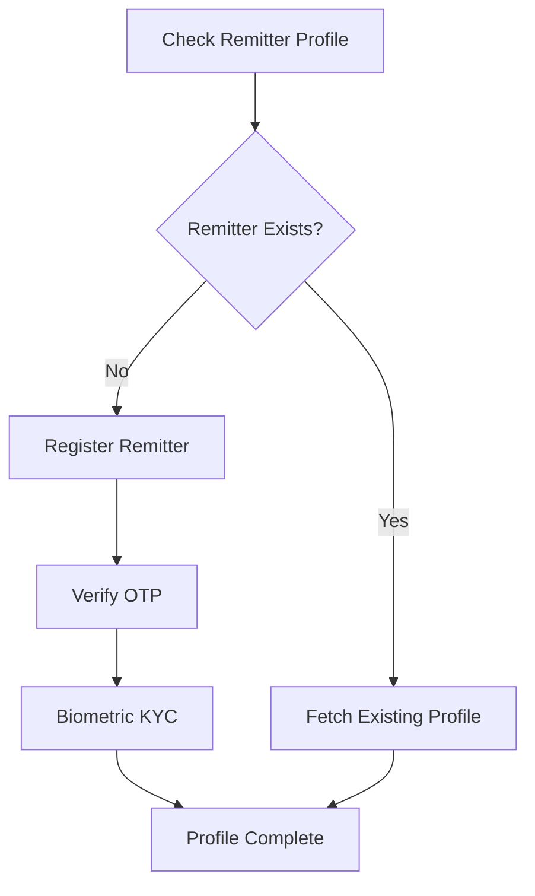
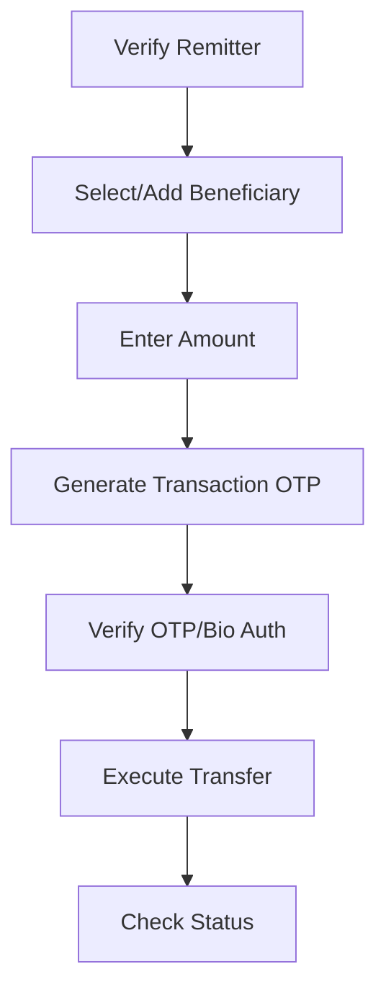
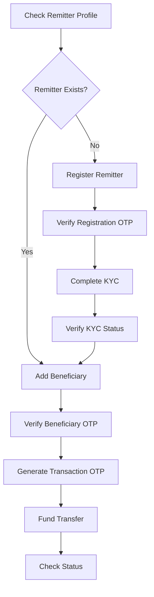

# DMT (Direct Money Transfer) Service Implementation

This implementation provides a complete backend solution for integrating InstantPay's DMT (Direct Money Transfer) service into your recharge application.

## Overview

The DMT service allows users to transfer money from their accounts to beneficiary bank accounts through InstantPay's API. This implementation includes:

- Complete database schema for DMT operations
- Remitter profile management
- Beneficiary management  
- Transaction logging and history
- Error handling and validation
- Configuration management

## Database Schema

### Tables Created

1. **`dmt_remitters`** - Stores remitter profile information
2. **`dmt_beneficiaries`** - Stores beneficiary details for each remitter
3. **`dmt_transactions`** - Logs all DMT transactions and API calls
4. **`dmt_config`** - Configuration settings for DMT service
5. **`dmt_charges`** - Commission and charge structure

### Setup Database

Run the SQL script to create the required tables:

```bash
mysql -u your_username -p your_database < dmt_tables.sql
```

## Environment Variables

Add these environment variables to your `.env` file:

```env
# InstantPay DMT Configuration
IPAY_AUTH_CODE=1
IPAY_CLIENT_ID=your_client_id_here
IPAY_CLIENT_SECRET=your_client_secret_here
IPAY_OUTLET_ID=your_outlet_id_here
```

## API Endpoints

### 1. Get Users
- **Endpoint:** `GET /api/dmt/getUsers?role_id=1`
- **Description:** Get users by role ID
- **Auth:** Required
- **Parameters:** 
  - `role_id` (query) - Role ID to filter users

### 2. Remitter Profile
- **Endpoint:** `GET /api/dmt/remitterProfile?mobile=9876543210`
- **Description:** Check if remitter exists and fetch profile from InstantPay
- **Auth:** Required
- **Parameters:**
  - `mobile` (query) - 10-digit mobile number

**Response Examples:**

*Remitter Not Found:*
```json
{
  "statuscode": "RNF",
  "status": "Remitter Not Found",
  "data": {
    "validity": "2025-01-06 12:05:05",
    "referenceKey": "s2ZfT5Bf0nzj1U0GZImtc646XxciZEMmo50OyDqJWjzfq8VciasgGQq6KsBIQss9",
    "isTxnOtpRequired": true,
    "isTxnBioAuthRequired": false,
    "isFaceAuthAvailable": false,
    "pidOptionWadh": "TF/lfPuh1n4ZY1xizYpqikIBm+gv65r51MFNek4uwNw="
  }
}
```

*Remitter Found:*
```json
{
  "statuscode": "TXN",
  "status": "Success",
  "data": {
    "mobileNumber": "9876543210",
    "firstName": "John",
    "lastName": "Doe",
    "limitPerTransaction": 5000,
    "limitTotal": "25000.00",
    "limitConsumed": "40.00",
    "limitAvailable": "24960.00",
    "beneficiaries": [...]
  }
}
```

### 3. Remitter Registration
- **Endpoint:** `POST /api/dmt/remitterRegistration`
- **Description:** Register a new remitter with InstantPay
- **Auth:** Required
- **Body:**
```json
{
  "mobile": "9876543210",
  "encryptedAadhaar": "encrypted_aadhaar_data",
  "referenceKey": "reference_key_from_profile_api"
}
```

### 4. Remitter Registration Verify
- **Endpoint:** `POST /api/dmt/remitterRegistrationVerify`
- **Description:** Verify remitter registration with OTP
- **Auth:** Required
- **Body:**
```json
{
  "mobile": "9876543210",
  "otp": "123456",
  "referenceKey": "reference_key_from_registration_response"
}
```

### 5. Remitter KYC
- **Endpoint:** `POST /api/dmt/remitterKyc`
- **Description:** Complete remitter KYC with biometric authentication
- **Auth:** Required
- **Body:**
```json
{
  "mobile": "9876543210",
  "latitude": "28.5093",
  "longitude": "77.2973",
  "referenceKey": "reference_key_from_verify_response",
  "captureType": "FINGER",
  "externalRef": "unique_external_reference",
  "consentTaken": "Y",
  "biometricData": {
    "dc": "device_code",
    "ci": "certificate_identifier",
    "hmac": "hmac_value",
    "dpId": "device_provider_id",
    "mc": "machine_code",
    "Skey": "session_key",
    "mi": "model_id",
    "rdsId": "rd_service_id",
    "pidData": "biometric_data",
    "rdsVer": "rd_service_version",
    "srno": "serial_number",
    "ts": "timestamp"
  }
}
```

### 6. Get Remitter KYC Status
- **Endpoint:** `GET /api/dmt/remitterKycStatus?mobile=9876543210`
- **Description:** Get KYC status for a remitter
- **Auth:** Required
- **Parameters:**
  - `mobile` (query) - 10-digit mobile number

### 7. Beneficiary Registration
- **Endpoint:** `POST /api/dmt/beneficiaryRegistration`
- **Description:** Register a new beneficiary for money transfer
- **Auth:** Required
- **Body:**
```json
{
  "beneficiaryMobileNumber": "8765432100",
  "remitterMobileNumber": "9876543210",
  "accountNumber": "32595104123",
  "ifsc": "SBIN0000001",
  "bankId": "109005",
  "name": "John Doe"
}
```

### 8. Beneficiary Registration Verify
- **Endpoint:** `POST /api/dmt/beneficiaryRegistrationVerify`
- **Description:** Verify beneficiary registration with OTP (only if statuscode is OTP)
- **Auth:** Required
- **Body:**
```json
{
  "remitterMobileNumber": "9876543210",
  "otp": "123456",
  "beneficiaryId": "bc607ec901164b636d747cda039e99cf",
  "referenceKey": "reference_key_from_registration_response"
}
```

### 9. Beneficiary Delete
- **Endpoint:** `POST /api/dmt/beneficiaryDelete`
- **Description:** Delete a beneficiary
- **Auth:** Required
- **Body:**
```json
{
  "remitterMobileNumber": "9876543210",
  "beneficiaryId": "bc607ec901164b636d747cda039e99cf"
}
```

### 10. Beneficiary Delete Verify
- **Endpoint:** `POST /api/dmt/beneficiaryDeleteVerify`
- **Description:** Verify beneficiary deletion with OTP (only if statuscode is OTP)
- **Auth:** Required
- **Body:**
```json
{
  "remitterMobileNumber": "9876543210",
  "beneficiaryId": "bc607ec901164b636d747cda039e99cf",
  "otp": "123456",
  "referenceKey": "reference_key_from_delete_response"
}
```

### 11. Get Beneficiaries
- **Endpoint:** `GET /api/dmt/beneficiaries?mobile=9876543210`
- **Description:** Get all beneficiaries for a remitter
- **Auth:** Required
- **Parameters:**
  - `mobile` (query) - 10-digit remitter mobile number

### 12. Generate Transaction OTP
- **Endpoint:** `POST /api/dmt/generateTransactionOtp`
- **Description:** Generate OTP for transaction verification
- **Auth:** Required
- **Body:**
```json
{
  "remitterMobileNumber": "9876543210",
  "amount": "1000",
  "referenceKey": "unique_reference_key"
}
```

### 13. Bio Auth Transaction
- **Endpoint:** `POST /api/dmt/bioAuthTransaction`
- **Description:** Execute transaction using biometric authentication
- **Auth:** Required
- **Body:**
```json
{
  "remitterMobileNumber": "9876543210",
  "latitude": "26.9124",
  "longitude": "75.7873",
  "referenceKey": "unique_reference_key",
  "externalRef": "external_reference_id",
  "otp": "123456",
  "amount": "1000",
  "consentTaken": "Y",
  "biometricData": {
    "encryptedAadhaar": "encrypted_aadhaar_data",
    "dc": "device_code",
    "ci": "certificate_identifier",
    "hmac": "hash_code",
    "dpId": "device_provider_id",
    "mc": "matching_criteria",
    "Skey": "session_key",
    "mi": "matching_info",
    "rdsId": "rd_service_id",
    "srno": "serial_number",
    "ts": "timestamp",
    "pidData": "biometric_data",
    "rdsVer": "rd_service_version"
  }
}
```

### 14. Fund Transfer (Main Transaction)
- **Endpoint:** `POST /api/dmt/fundTransfer`
- **Description:** Execute money transfer to beneficiary
- **Auth:** Required
- **Body:**
```json
{
  "remitterMobileNumber": "9876543210",
  "accountNumber": "32595104123",
  "ifsc": "SBIN0000001",
  "transferMode": "IMPS",
  "transferAmount": "1000",
  "latitude": "26.9124",
  "longitude": "75.7873",
  "referenceKey": "unique_reference_key",
  "otp": "123456",
  "externalRef": "external_reference_id"
}
```

**Transfer Modes:** IMPS, NEFT, RTGS

**Amount Limits:**
- IMPS: ₹1 - ₹2,00,000
- NEFT: Minimum ₹1 (no upper limit)
- RTGS: Minimum ₹2,00,000

### 15. Get Transaction Status
- **Endpoint:** `GET /api/dmt/transactionStatus?referenceId=external_reference_id`
- **Description:** Get status of a specific transaction
- **Auth:** Required
- **Parameters:**
  - `referenceId` (query) - External reference ID used during transaction

### 16. Get Transaction History
- **Endpoint:** `GET /api/dmt/transactionHistory?page=1&limit=20&transaction_type=FUND_TRANSFER&status=TXN`
- **Description:** Get paginated transaction history for user
- **Auth:** Required
- **Parameters:**
  - `page` (query, optional) - Page number (default: 1)
  - `limit` (query, optional) - Records per page (default: 20, max: 100)
  - `transaction_type` (query, optional) - Filter by transaction type
  - `status` (query, optional) - Filter by transaction status

### 17. Get My Remitter Details
- **Endpoint:** `GET /api/dmt/myRemitterDetails`
- **Description:** Get all remitter profiles for current user
- **Auth:** Required

## Implementation Flow

### 1. Remitter Onboarding Flow



### 2. Money Transfer Flow



### 3. Complete Registration to Transfer Flow



## Features Implemented

### ✅ Completed Features

1. **Remitter Profile Management**
   - Check remitter existence
   - Sync local database with InstantPay
   - Store remitter details locally

2. **Remitter Registration Flow**
   - Initiate remitter registration
   - OTP verification for registration
   - Complete biometric KYC process
   - KYC status tracking

3. **Beneficiary Management**
   - Add new beneficiaries
   - OTP verification for beneficiary registration
   - Delete beneficiaries with OTP verification
   - List all beneficiaries for a remitter
   - Local database sync for beneficiaries

4. **Transaction Management**
   - Generate transaction OTP
   - Biometric authentication transactions
   - Fund transfer with OTP verification
   - Transaction status tracking
   - Transaction history with pagination
   - Amount validation and limits checking

5. **Database Integration**
   - Complete database schema
   - Transaction logging for all operations
   - Error tracking
   - KYC completion tracking
   - Beneficiary status management
   - Real-time limit updates

6. **Configuration Management**
   - Environment-based configuration
   - Validation of required settings

7. **Security & Compliance**
   - Data masking for sensitive information (OTP, Aadhaar, Biometric)
   - Input validation and sanitization
   - User authorization checks
   - Secure API communication

8. **Error Handling**
   - Comprehensive error handling
   - Failed transaction logging
   - Proper HTTP status codes

9. **Logging & Monitoring**
   - Detailed logging of all API requests and responses
   - Monitoring of transaction statuses and error rates

10. **Testing & Validation**
    - Postman collections for API testing
    - Sample data for testing remitter and beneficiary flows
    - Test cases for all API endpoints

## Usage Examples

### Complete Transaction Flow Example

```javascript
// 1. Check if remitter exists
const checkRemitter = await fetch('/api/dmt/remitterProfile?mobile=9876543210', {
  headers: { 'Authorization': 'Bearer ' + token }
});

// 2. If remitter doesn't exist, register
if (!checkRemitter.data.exists) {
  const registerRemitter = await fetch('/api/dmt/remitterRegistration', {
    method: 'POST',
    headers: { 'Authorization': 'Bearer ' + token },
    body: JSON.stringify({
      firstName: "John",
      lastName: "Doe",
      mobileNumber: "9876543210",
      address: "123 Main St",
      pincode: "302001"
    })
  });
  
  // Verify registration OTP
  const verifyOtp = await fetch('/api/dmt/remitterRegistrationVerify', {
    method: 'POST',
    headers: { 'Authorization': 'Bearer ' + token },
    body: JSON.stringify({
      mobile: "9876543210",
      otp: "123456",
      referenceKey: registerRemitter.data.referenceKey
    })
  });
}

// 3. Add beneficiary
const addBeneficiary = await fetch('/api/dmt/beneficiaryRegistration', {
  method: 'POST',
  headers: { 'Authorization': 'Bearer ' + token },
  body: JSON.stringify({
    beneficiaryMobileNumber: "8765432100",
    remitterMobileNumber: "9876543210",
    accountNumber: "32595104123",
    ifsc: "SBIN0000001",
    bankId: "109005",
    name: "Jane Doe"
  })
});

// 4. Verify beneficiary (if OTP required)
if (addBeneficiary.data.statuscode === 'OTP') {
  await fetch('/api/dmt/beneficiaryRegistrationVerify', {
    method: 'POST',
    headers: { 'Authorization': 'Bearer ' + token },
    body: JSON.stringify({
      remitterMobileNumber: "9876543210",
      otp: "123456",
      beneficiaryId: addBeneficiary.data.beneficiaryId,
      referenceKey: addBeneficiary.data.referenceKey
    })
  });
}

// 5. Generate transaction OTP
const generateOtp = await fetch('/api/dmt/generateTransactionOtp', {
  method: 'POST',
  headers: { 'Authorization': 'Bearer ' + token },
  body: JSON.stringify({
    remitterMobileNumber: "9876543210",
    amount: "1000",
    referenceKey: "unique_ref_" + Date.now()
  })
});

// 6. Execute fund transfer
const transfer = await fetch('/api/dmt/fundTransfer', {
  method: 'POST',
  headers: { 'Authorization': 'Bearer ' + token },
  body: JSON.stringify({
    remitterMobileNumber: "9876543210",
    accountNumber: "32595104123",
    ifsc: "SBIN0000001",
    transferMode: "IMPS",
    transferAmount: "1000",
    latitude: "26.9124",
    longitude: "75.7873",
    referenceKey: generateOtp.data.referenceKey,
    otp: "123456",
    externalRef: "txn_" + Date.now()
  })
});

// 7. Check transaction status
const status = await fetch('/api/dmt/transactionStatus?referenceId=txn_' + Date.now(), {
  headers: { 'Authorization': 'Bearer ' + token }
});
```

### Bio-Auth Transaction Example

```javascript
// For merchants with biometric devices
const bioAuthTxn = await fetch('/api/dmt/bioAuthTransaction', {
  method: 'POST',
  headers: { 'Authorization': 'Bearer ' + token },
  body: JSON.stringify({
    remitterMobileNumber: "9876543210",
    latitude: "26.9124",
    longitude: "75.7873",
    referenceKey: "unique_ref_" + Date.now(),
    externalRef: "bio_txn_" + Date.now(),
    otp: "123456",
    amount: "1000",
    consentTaken: "Y",
    biometricData: {
      encryptedAadhaar: "encrypted_aadhaar_from_device",
      dc: "device_code_from_biometric_device",
      ci: "certificate_identifier",
      hmac: "hash_from_device",
      dpId: "device_provider_id",
      mc: "matching_criteria_FMR",
      Skey: "session_key_from_device",
      mi: "matching_info",
      rdsId: "rd_service_identifier",
      pidData: "encrypted_biometric_data",
      rdsVer: "1.0.0"
    }
  })
});
```

## Error Handling

### Common Error Responses

```json
// Validation Error
{
  "success": false,
  "statusCode": 400,
  "message": "Invalid mobile number format",
  "data": null
}

// Authentication Error
{
  "success": false,
  "statusCode": 401,
  "message": "Authentication required",
  "data": null
}

// Insufficient Limit Error
{
  "success": false,
  "statusCode": 400,
  "message": "Insufficient remitter limit. Available limit: ₹50000",
  "data": null
}

// Transaction Failed
{
  "success": false,
  "statusCode": 400,
  "message": "Transaction failed due to insufficient balance",
  "data": {
    "ipay_uuid": "uuid_from_instantpay",
    "orderid": "order_id_from_instantpay",
    "status": "Transaction failed"
  }
}
```

## Security & Compliance

### Data Protection
- All sensitive data (OTP, Aadhaar, Biometric) is masked in logs
- Database queries use parameterized statements
- API responses exclude sensitive internal data
- Transaction logs maintain audit trail

### Validation
- Mobile number format validation (10 digits, starts with 6-9)
- IFSC code format validation
- Account number validation (9-18 digits)
- Amount limits based on transfer mode
- Geographic coordinate validation
- OTP format validation (6 digits)

### Business Rules
- Remitter limit checking before transactions
- Beneficiary verification before transfers
- Transaction type validation
- Transfer mode specific limit enforcement

## Future Enhancements

### 🔄 Planned Features

1. **Webhook Integration**
   - Real-time transaction status updates
   - Automatic status sync with InstantPay

2. **Advanced Reporting**
   - Detailed transaction analytics
   - Commission calculation and reporting
   - Settlement reports

3. **Bank Management**
   - Integration with InstantPay bank list API
   - Bank status monitoring
   - IFSC validation with bank data

4. **Enhanced Security**
   - Transaction PIN verification
   - Device fingerprinting
   - Risk management rules

5. **Admin Features**
   - Transaction monitoring dashboard
   - User management
   - Commission configuration
   - Limit management

## Support

For implementation support or questions about the DMT service integration, refer to the InstantPay API documentation or contact technical support.

## Version History

- **v1.0.0** - Initial implementation with complete DMT functionality
  - Remitter registration and KYC
  - Beneficiary management
  - Transaction processing (OTP and Bio-auth)
  - Transaction history and status tracking
  - Comprehensive error handling and validation
